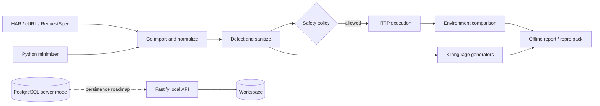
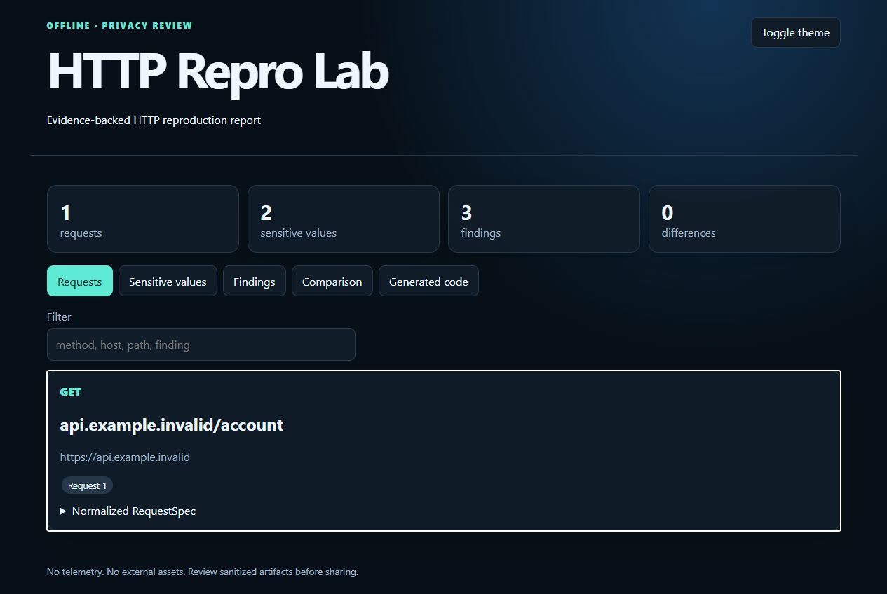

# HTTP Repro Lab

Turn HAR, cURL, Postman and raw HTTP into safe, reproducible API test cases.

Offline-first. Privacy-first. Multi-language.

[](https://github.com/German4341374/http-repro-lab/actions/workflows/ci.yml)
[](https://github.com/German4341374/http-repro-lab/actions/workflows/integration.yml)
[](https://github.com/German4341374/http-repro-lab/actions/workflows/security.yml)
[](LICENSE)

HTTP Repro Lab is a local developer workbench for answering a difficult support question: _what request actually happened, what sensitive data does it contain, and can the failure be reproduced safely?_ It imports HTTP evidence as data, creates a canonical request, replaces credentials with placeholders, applies explicit network safety policy, and produces evidence-backed comparisons and executable repro clients.

> [!WARNING]
> HAR files can contain cookies, access tokens, personal data, and complete request bodies. Sanitization reduces risk; it cannot prove an artifact is safe to publish. Review every exported file and rotate credentials that crossed an unintended trust boundary.

## Quick start

Requirements: Go 1.26.7. No database or cloud account is required for the CLI.

```bash
go run ./cmd/http-repro analyze fixtures/auth-401.har --strict --output report
```

Open `report/index.html` directly. It has no CDN, telemetry, or backend dependency.

```bash
go run ./cmd/http-repro har summary fixtures/auth-401.har
go run ./cmd/http-repro sanitize fixtures/auth-401.har --request 1 --output request.json
go run ./cmd/http-repro generate request.json --output generated
go run ./cmd/http-repro pack request.json --output authentication-issue.repro.zip
```

## Why it exists

API failures are frequently reported as “works in Postman, fails in production” or “staging returns 200, production returns 401.” Copying a capture into shell history or an online converter creates a second incident: credentials can be executed, logged, or uploaded. HTTP Repro Lab keeps the primary workflow local and treats every imported byte as untrusted.

The output separates:

- **Observed difference** — facts such as status, header, JSON type, TLS issuer, or latency.
- **Evidence** — the HAR entry, response field, or execution measurement.
- **Possible interpretation** — a hypothesis, never an unsupported root-cause claim.
- **Suggested verification** — the next safe check.

## Architecture



Go owns the trusted parsing, policy, network, comparison, reporting, and generation path. Fastify provides an optional local API for browsing analysis sessions. Python implements a deterministic, budgeted JSON minimizer. Java, C#, and PHP include runnable reference runners; generated JavaScript, TypeScript, Python, Go, Java, C#, and PHP clients are executed against the same echo server in CI. PostgreSQL migrations define durable server-mode history without making the database a CLI dependency.

See [architecture overview](docs/architecture/overview.md), [request model](docs/architecture/request-model.md), [security architecture](docs/architecture/security.md), and the [ADRs](docs/adr/).

## Working features

- HAR 1.2 request parsing with immutable source SHA-256 and malformed-input errors.
- cURL parsing without shell execution; command substitution and chaining are rejected.
- Canonical versioned `RequestSpec` with ordered headers and query pairs.
- Detection of authorization, cookies, JWT-like values, API keys, passwords, session values, private-key markers, email, and phone patterns.
- Standard and strict sanitization with stable placeholders and idempotence tests.
- Explicit write-method gate, destination validation, DNS resolution checks, private/link-local/metadata blocking, redirect revalidation, timeouts, and response capture limits.
- DNS/TCP/TLS/TTFB/total timing hooks, TLS metadata, redirect history, body hashing, and binary-safe capture behavior.
- Status, selected header, TLS, response-size, and JSON structural comparison.
- Offline report, sanitized repro ZIP with checksums, and eight executable client formats.
- Local mock API, strict TypeScript control plane, deterministic Python minimizer, PostgreSQL migrations, Docker Compose, and CI security gates.

The exact implementation boundary is maintained in [project status](docs/project-status.md). Postman and OpenAPI import, network-backed minimization, and durable API persistence are not claimed as complete.

## Supported inputs

| Input | Status | Notes |
|---|---:|---|
| HAR | Implemented | Request, headers, query, JSON/text body, source status and duration |
| cURL | Implemented subset | Common method/header/body/auth/cookie/timeout flags; never invokes a shell |
| RequestSpec JSON | Implemented | Native canonical format |
| Raw HTTP | Planned | Schema and importer boundary are defined |
| Postman v2.x | Planned | Secret-aware variable resolution is not yet implemented |
| OpenAPI | Planned | Operation-template generation is not yet implemented |

## Generated languages

| Output | Runtime | Verification |
|---|---|---|
| cURL | POSIX shell + cURL | Executed against echo server |
| JavaScript | Node.js Fetch | Executed against echo server |
| TypeScript | Node.js Fetch | Strictly compiled and executed |
| Python | `urllib` | Executed against echo server |
| Go | `http.Client` | Compiled and executed |
| Java | `java.net.http.HttpClient` | Compiled and executed |
| C# | `HttpClient` | Compiled and executed |
| PHP | cURL extension | Executed against echo server |

Generated clients use explicit timeouts, do not follow redirects automatically, skip unsafe `Host` and `Content-Length` injection, and retain sanitized placeholders. They are diagnostic examples, not a credential store.

## Reproduce a synthetic request

Start the included test laboratory:

```bash
go run ./cmd/mock-api
```

In another terminal:

```bash
go run ./cmd/http-repro reproduce fixtures/echo-request.json \
  --target http://127.0.0.1:9090 \
  --allow-private --allow-write \
  --output response.json
```

`--allow-private` is intentionally required for the loopback laboratory. `--allow-write` is intentionally required for POST. Neither flag is implied by `--yes` or noninteractive operation.

## Compare environments

```bash
go run ./cmd/http-repro compare fixtures/echo-request.json \
  --target-a http://127.0.0.1:9090 \
  --target-b http://127.0.0.1:9091 \
  --allow-private --output comparison.json
```

Exit code `1` means a reproduction mismatch; `2` invalid input; `3` a safety-policy block; `4` a network failure; and `5` an internal error. A difference is evidence, not an automatic root-cause declaration.

## Local API

```bash
cd apps/api
npm ci
npm run dev
curl http://127.0.0.1:8080/health
```

Implemented endpoints include `POST /api/v1/analyses`, analysis retrieval, paginated requests, filtered findings, a terminal SSE event, `/health`, `/ready`, and `/metrics`. The API binds to loopback by default, sets CSP and related headers, disables CORS, limits bodies, uses uniform errors, and logs request IDs without authorization data.

## Docker Compose

```bash
cp .env.example .env
# Replace development placeholders before sharing the environment.
docker compose up --build --wait
curl http://127.0.0.1:8080/health
curl http://127.0.0.1:8081/
curl http://127.0.0.1:9090/health
docker compose down
```

Containers are multi-stage, non-root where the upstream image supports it, capability-restricted, read-only where practical, and connected through separated networks. The Compose stack is intended for WSL2/Linux Docker Engine or Docker Desktop with WSL2 enabled.

## Development and verification

```bash
make setup
make lint
make typecheck
make test
make integration
make build
make verify
```

Individual commands and the latest locally observed results are listed in [verification](docs/verification.md). CI repeats language tests, PostgreSQL migrations, generated-client semantic checks, Docker health checks, dependency review, secret scanning, CodeQL, Trivy, and SBOM generation.

## Performance evidence

The repository includes deterministic 10k, 50k, and 100k-entry parse/report benchmarks. On the documented local host, the median 100k parse sample was 475.139 ms with 357,567,224 allocated bytes per operation; this allocation result is why iterative HAR decoding remains a roadmap item. See the complete command, environment, all medians, and caveats in [benchmark results](benchmarks/results.md). These diagnostic samples are not cross-platform performance guarantees.

## Privacy and security

Telemetry, analytics, cloud upload, remote processing, external AI, and automatic credential reuse are off. HTTP evidence is rendered with `textContent`, not HTML injection. The CLI does not execute cURL through a shell. Every redirect passes destination policy again, and cross-host redirects lose authorization and cookie headers.

Read [privacy guidance](docs/privacy.md), the [threat model](docs/threat-model.md), and [SECURITY.md](SECURITY.md). Report vulnerabilities privately; do not attach a real HAR to a public issue.

## Screenshot

The screenshot below is captured from the generated synthetic offline report.



## Troubleshooting

- `TARGET_BLOCKED`: review the resolved address and allowlist; use `--allow-private` only for a controlled local target.
- `HTTP_TIMEOUT`: verify reachability, then increase the explicit RequestSpec timeout within policy limits.
- `HAR_MALFORMED`: validate JSON and export a fresh HAR without editing its source in place.
- Docker engine unavailable on Windows: install/enable WSL2 and reopen Docker Desktop before `docker compose up`.
- Generated client fails: compare runtime defaults such as proxy settings, trusted certificates, and content encoding with [the runbook](docs/runbooks/generated-client-failure.md).

## Limitations

- HAR parsing currently focuses on request reproduction fields rather than the complete waterfall/security-state model.
- Sanitization uses deterministic rules and cannot recognize every organization-specific identifier.
- Remote server mode, token authentication, persistent Fastify storage, OpenTelemetry export, Helm, and Terraform are roadmap items.
- Timing is a diagnostic sample, not a performance benchmark; network stacks can reuse connections and hide individual phases.
- The Python minimizer currently minimizes JSON in a pure predicate boundary; the Go CLI does not yet expose network-backed `minimize`.

## Roadmap and contributing

Roadmap phases are in [ROADMAP.md](ROADMAP.md). New importers and generators must preserve the canonical model, have adversarial tests, and document semantic differences. Start with [CONTRIBUTING.md](CONTRIBUTING.md), the [governance model](GOVERNANCE.md), and the issue templates.

## License

Licensed under the Apache License 2.0. See [LICENSE](LICENSE) and [NOTICE](NOTICE).
