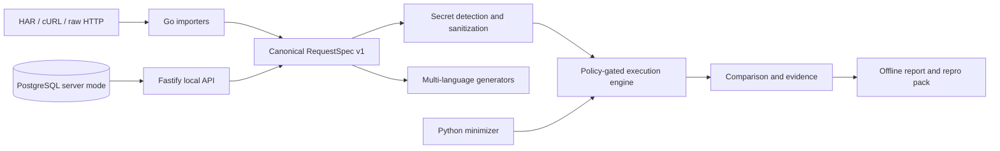

# Architecture overview

The Go binary is the trusted orchestration boundary. Imports are data, never executable shell. Original sources are immutable and addressed by SHA-256. Network execution is explicit, bounded, and governed by method and target policies. The browser report is static and renders all evidence with text-only DOM APIs.

